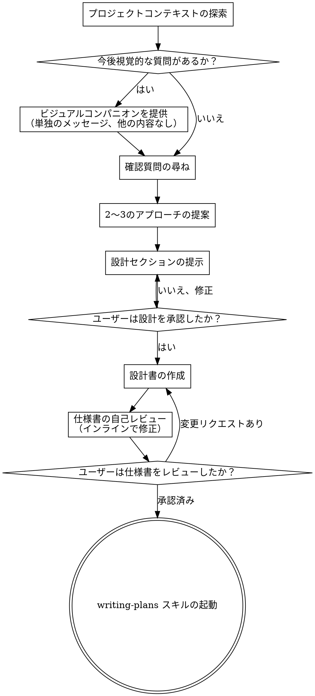

# アイデアから設計へのブレインストーミング

自然な対話を通じて、アイデアを完全な形の設計と仕様書に変えることを支援します。

まず現在のプロジェクトコンテキストを理解し、次にアイデアを洗練させるために1つずつ質問をします。何を作るか理解したら、設計を提示してユーザーの承認を得ます。

<HARD-GATE>
設計を提示し、ユーザーが承認するまでは、いかなる実装スキルも起動せず、コードを書かず、プロジェクトの足場を組まず、実装アクションを取らないでください。これは、単純だと認識されるすべてのプロジェクトに適用されます。
</HARD-GATE>

## アンチパターン: "これは設計を必要としないほど単純だ"

すべてのプロジェクトはこのプロセスを経る必要があります。Todoリスト、単一関数のユーティリティ、設定の変更 - すべてです。「単純」なプロジェクトこそ、未検証の前提が最も無駄な作業を引き起こすところです。設計は短くても構いません（本当に単純なプロジェクトでは数文程度）、ただし提示して承認を得る必要があります。

## チェックリスト

以下の項目ごとにタスクを作成し、順番に完了する必要があります:

1. **プロジェクトコンテキストの探索** - ファイル、ドキュメント、最近のコミットを確認
2. **ビジュアルコンパニオンの提供**（視覚的な質問を含むトピックの場合）- これは単独のメッセージであり、確認質問と組み合わせない。詳細は下記の「ビジュアルコンパニオン」セクションを参照
3. **確認質問の尋ね** - 1つずつ、目的/制約/成功基準を理解する
4. **2〜3のアプローチの提案** - トレードオフと推奨案を含む
5. **設計の提示** - 複雑さに応じたセクションに分けて、各セクション後にユーザーに確認
6. **設計書の作成** - `docs/specs/YYYY-MM-DD-<topic>-design.md` に保存してコミット
7. **仕様書の自己レビュー** - プレースホルダー、矛盾、曖昧さ、スコープのインライン確認（下記参照）
8. **ユーザーによる書面仕様書のレビュー** - 進む前にユーザーに仕様書ファイルをレビューしてもらう
9. **実装への移行** - writing-plans スキルを起動して実装計画を作成

## プロセスフロー

**終了状態は writing-plans の起動です。** frontend-design、mcp-builder、またはその他の実装スキルは起動しないでください。ブレインストーミングの後に起動する唯一のスキルは writing-plans です。

## プロセス

**アイデアの理解:**

- まず現在のプロジェクト状態を確認してください（ファイル、ドキュメント、最近のコミット）
- 詳細な質問をする前に、スコープを評価してください: リクエストが複数の独立したサブシステムを記述している場合（例: "チャット、ファイルストレージ、課金、分析を持つプラットフォームを構築する"）、これを即座に指摘してください。分解が必要なプロジェクトの詳細を洗練させる質問に時間を費やさないでください。
- プロジェクトが単一の仕様書に対して大きすぎる場合、ユーザーがサブプロジェクトに分解するのを手伝ってください: 独立した部分は何か、どのように関連しているか、どの順序で構築すべきか？ その後、通常の設計フローを通じて最初のサブプロジェクトをブレインストーミングしてください。各サブプロジェクトは独自の仕様書 → 計画 → 実装サイクルを取得します。
- 適切なスコープのプロジェクトについては、アイデアを洗練させるために1つずつ質問をしてください
- 可能であれば選択肢形式の質問を優先しますが、自由記述でも構いません
- 1つのメッセージに1つの質問のみ - トピックにさらなる探索が必要な場合は、複数の質問に分割してください
- 目的、制約、成功基準の理解に焦点を当ててください

**アプローチの探索:**

- トレードオフを含む2〜3の異なるアプローチを提案してください
- 推奨案と理由を含めて、対話的に選択肢を提示してください
- 推奨オプションから始めて、理由を説明してください

**設計の提示:**

- 何を作るか理解したと信じたら、設計を提示してください
- 各セクションをその複雑さに応じて調整: 簡単な場合は数文、微妙な場合は200〜300語まで
- 各セクションの後に、現時点で正しそうかどうかを尋ねてください
- カバーする内容: アーキテクチャ、コンポーネント、データフロー、エラーハンドリング、テスト
- 何かが意味を成さない場合は、戻って明確にする準備をしてください

**分離と明確さのための設計:**

- システムを、それぞれが明確な目的を持ち、明確に定義されたインターフェースを通じて通信し、独立して理解およびテストできる小さな単位に分割してください
- 各単位について、何をするか、どのように使用するか、何に依存するかを答えられるべきです
- 誰かが単位の内部を読まなくても何をするか理解できますか？ 内部を変更しても利用者を壊さずに済みますか？ そうでない場合、境界を見直す必要があります。
- 小さく、明確に境界付けられた単位は、あなたが一度に文脈に収められるコードについてより良く推論でき、ファイルが集中しているときに編集がより信頼性が高くなるため、扱いやすいです。ファイルが大きくなったとき、それは多くのことをしすぎていることを示すことがよくあります。

**既存のコードベースでの作業:**

- 変更を提案する前に現在の構造を探索してください。既存のパターンに従ってください。
- 既存のコードに作業に影響する問題がある場合（例: 大きくなりすぎたファイル、不明確な境界、絡み合った責任）、優れた開発者が作業しているコードを改善する方法として、設計の一部として対象を絞った改善を含めてください。
- 関連しないリファクタリングを提案しないでください。現在の目標に役立つことに集中してください。

## 設計後

**ドキュメント:**

- 検証済みの設計（仕様書）を `docs/specs/YYYY-MM-DD-<topic>-design.md` に書き込んでください

**仕様書の自己レビュー:**
仕様書ドキュメントを書いた後、新鮮な目で見てください:

1. **プレースホルダースキャン:** "TBD"、"TODO"、不完全なセクション、または曖昧な要件はありませんか？ 修正してください。
2. **内部的一貫性:** セクション間に矛盾はありませんか？ アーキテクチャは機能の説明と一致していますか？
3. **スコープチェック:** 単一の実装計画に十分に焦点が当てられているか、分解が必要ですか？
4. **曖昧さチェック:** 要件は2通りに解釈される可能性がありますか？ そうであれば、1つを選んで明示してください。

問題をインラインで修正してください。再レビューする必要はありません - 修正して先に進んでください。

**ユーザーレビューゲート:**
仕様書レビューループをパスした後、進む前にユーザーに書面の仕様書をレビューしてもらうように依頼してください:

> "仕様書を `<path>` に書き込み、コミットしました。実装計画の作成を開始する前に、変更を加えたい場合はレビューして教えてください。"

ユーザーの応答を待ってください。変更をリクエストした場合は、それらを行って仕様書レビューループを再実行してください。ユーザーが承認した場合のみ進んでください。

**実装:**

- 詳細な実装計画を作成するために writing-plans スキルを起動してください
- 他のスキルは起動しないでください。次のステップは writing-plans です。

## 主要な原則

- **1つずつ質問する** - 複数の質問で圧倒しない
- **可能なら選択肢形式を優先** - 自由記述より回答しやすい
- **YAGNIを徹底する** - すべての設計から不要な機能を削除
- **代替案を探索する** - 決定する前に常に2〜3のアプローチを提案
- **増分的な検証** - 進む前に設計を提示して承認を得る
- **柔軟である** - 何かが意味を成さない場合は、戻って明確にする
